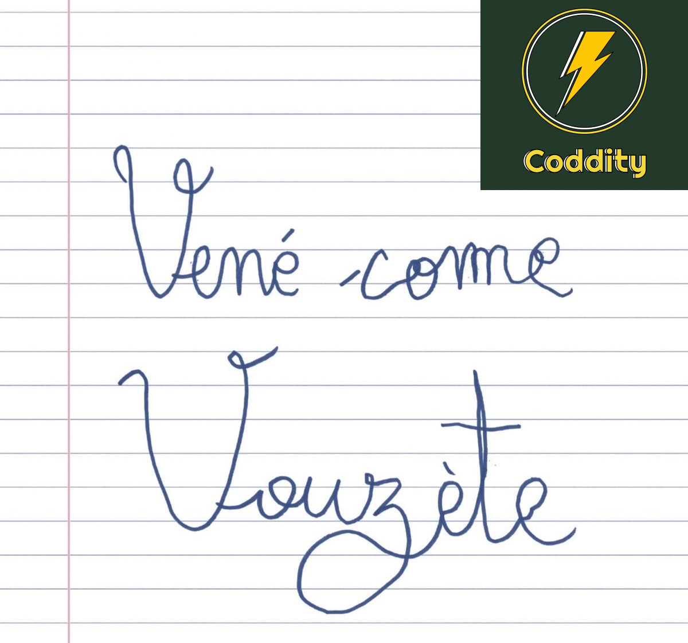

# Viendez chez Coddity !

Nous aussi on met nos **offres d'emploi** dans les [issues](https://github.com/CoddityTeam/crew/issues) sur un repo Github. Mais nous c'est mieux. 

Nous recherchons des personnes **humbles** (cf. paragraphe précédent). Plus d'infos sous l'infographie elle-même située ci-dessous et dans les issues.
                                                                
Le process de recrutement Coddity : 
- un entretien avec Matthieu, pour discuter de tout, de rien et un peu sur les  ordinateurs
- un entretien plus avec Yoann ou Vincent qui poseront pleins de questions sur votre culture informatique
- un entretien avec Christopher, pour discuter de tout et de rien avec majoritairement des questions-réponses sur Coddity
Le tout dans la joie, la bonne humeur et sans épreuve sportive.

Pour répondre aux offres, lisez les offres jusqu'au bout c'est indiqué. Est-ce que cette phrase est vraiment utile ? oui.

Avec le code BONUS2022, vous pouvez même avoir un quatrième entretien bonus si vous le souhaitez ! 

